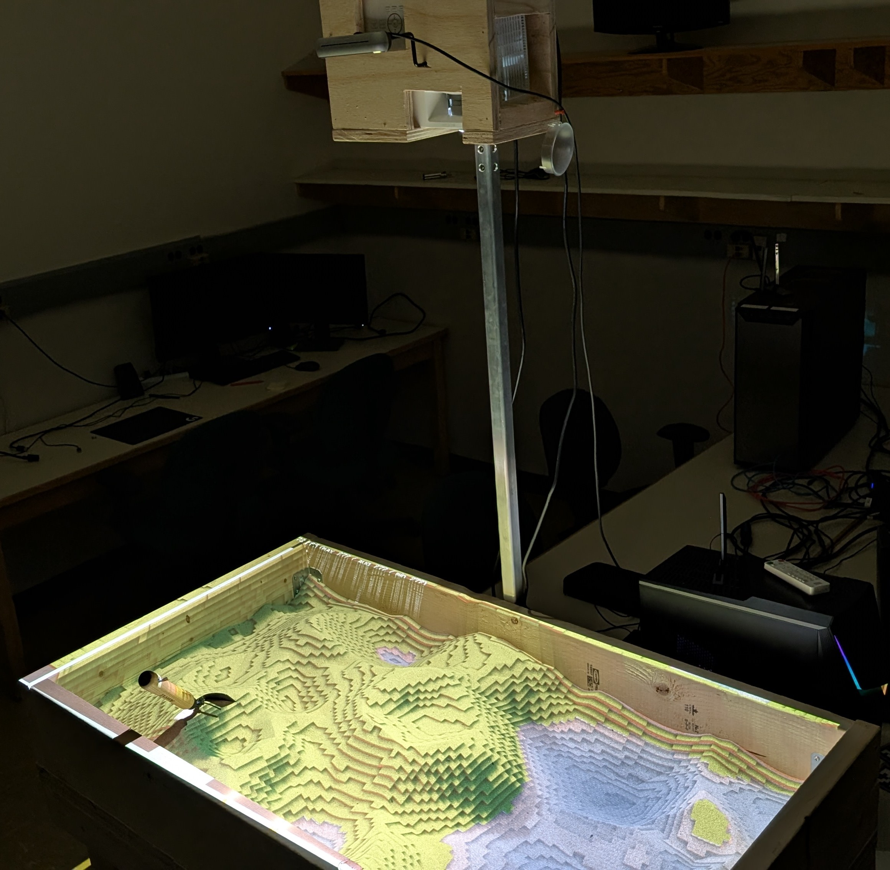

# Minecraft Augmented Reality Sandbox

This repository contains the resources necessary to connect the Augmented Reality Sandbox to Minecraft.

The Augmented Reality Sandbox is a physical device that projects images onto sand, where those images are primarily derived from the topography of the sand. Traditionally the image is a topographical map of the sand that updates in real-time. For more information please see the [UC Davis version of the AR Sandbox](https://web.cs.ucdavis.edu/~okreylos/ResDev/SARndbox/).

The software presented here allows the AR Sandbox to be used to control the world of the video game Minecraft. The shape of the terrain is made to match the shape of the sand, and a view of the world is projected onto the sand. Players can reshape the game world by pushing around the sand and see the effects immediately.

Our main AR Sandbox repo can be found [here](https://github.com/davechurchill/sandbox), which contains the main sandbox software, without the connection to Minecraft.

This project was completed as my Masters Thesis in Computer Science at Memorial University of Newfoundland.

# Installation and Setup

Connecting the AR Sandbox to Minecraft requires three programs: the sandbox software, the Minecraft server, and the Minecraft client.

## Sandbox Software

Connecting to the depth camera and processing the height data is done by the sandbox software.

See [here](https://github.com/davechurchill/sandbox/tree/d9a42738b25620cce52798e235595081e46c92eb) for the main setup instructions.

The Minecraft version of the software has one additional dependency: libzmq 4.3.5

Once the software is running, make sure the source is set to "Camera" and the processor to "Minecraft", then press the "Connect" button in the Minecraft processor. This will begin the connection to the server.

## Minecraft Server

The Minecraft server is responsible for running the game world, and allows players to connect to it. To handle reshaping the terrain and playing minigames, we developped a plugin for this server.

First, download a Spigot server for version 1.21.4 (see [here](https://www.spigotmc.org/wiki/buildtools/) for instructions). This is a modified version of a Minecraft server that allows for plugins.

Second, add the plugin file to the server's plugins folder. The plugin file can be built from source, or found in the releases section of this repo.

Third, download and add the Fast Asynch WorldEdit 2.13.0 plugin to the plugins folder. This is a dependency of our plugin which handles placing blocks.

Fourth, run the server to check that it is working and have it set up the config files. If you wish, you can replace the spigot.yml file in the server folder and the config.yml file in plugins/ARSandbox_Spigot/ with the files provided here. This will ensure that the server is configured correctly, though you may want to make your own adjustments.

Controlling the sandbox plugin can be done using the /sandbox command.

## Minecraft Client

To display the world onto the sand, it is necessary to have a player connected to the server on a Minecraft client. This can be a regular instance of Minecraft on version 1.21.4, but we recommend using a modded client.

You will need a Minecraft account and to download a Minecraft launcher, such as modrinth or Prisma. Then load the "Fabulously Optimized - Modified 1.0.0.mrpack" file here included as a modpack, which should set up a profile with optimization mods, shaders, and an orthographic camera mod.

After running the game, you will need to connect to the server. If the server is running on the same computer as the client, putting 127.0.0.1 as the server address will suffice. Once connected to the server, you must position the player so that they are flying (in spectator mode) above the terrain that is being controlled by the sandbox. The client must then be placed on the display that is being rendered by the projector onto the sand. 

We recommend using the orthographic camera mod to orient the camera based off your setup.
It may also be necessary to flip the orientation of the display through the operating system.
Once the Minecraft terrain lines up more or less with the sand it is based on, the system is ready.